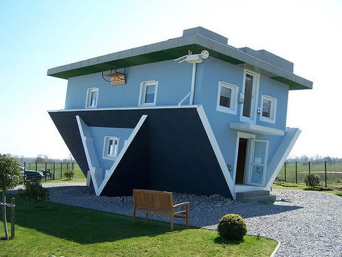

# Documentation POC

## Objet du document

Lorem ipsum dolor sit amet, *consectetur adipiscing elit*. Duis dolor dolor, elementum a dapibus quis, pretium at tellus. Donec luctus a ante eget faucibus. Phasellus vitae felis urna. Phasellus ultrices odio ac ipsum efficitur tempus. In hac habitasse platea dictumst. Maecenas condimentum vehicula risus et pretium. Vivamus pretium cursus nisi eu varius. Donec iaculis ante sit amet ipsum vehicula, eget tristique dui volutpat.

Praesent sagittis nunc ut libero tempus fringilla. Maecenas vitae lacus sed velit finibus egestas. Integer felis libero, feugiat a fermentum a, dignissim ac lectus. Sed eleifend id enim nec hendrerit. Aliquam egestas scelerisque ligula, non semper urna hendrerit accumsan. Etiam congue, purus vel suscipit dictum, sapien magna accumsan nulla, suscipit molestie libero orci vitae magna. Vivamus a dignissim ex. Maecenas fermentum convallis vulputate. **Aenean tortor enim**, viverra ut sagittis bibendum, egestas non est. Aliquam mauris libero, volutpat a diam nec, commodo finibus leo. Etiam aliquet ante non tempus iaculis. Vivamus scelerisque eu leo a dictum.

Sed et libero id urna congue tempor eu a lectus :

  * Lorem ipsum dolor sit amet, *consectetur adipiscing* elit.
  * Fusce pellentesque lacus aliquet euismod commodo.
  * Cras id ligula at nunc euismod bibendum non sed risus.
  * **Maecenas ut sem** eu ipsum sollicitudin vehicula.
  * Vestibulum eget elit vitae purus suscipit dapibus.

> Ut malesuada turpis a pretium lacinia.

## How to Java?

> Timmy!

Let's embed a bunch of Java from our snippet file:

{{ d['snippets/SAKARAH-001-classified-documentation-snippets.java|idio|l']['bar'] }}

And another one cause, ya know, we luv java:

{{ d['snippets/SAKARAH-001-classified-documentation-snippets.java|idio|l']['foo'] }}

## Software design

